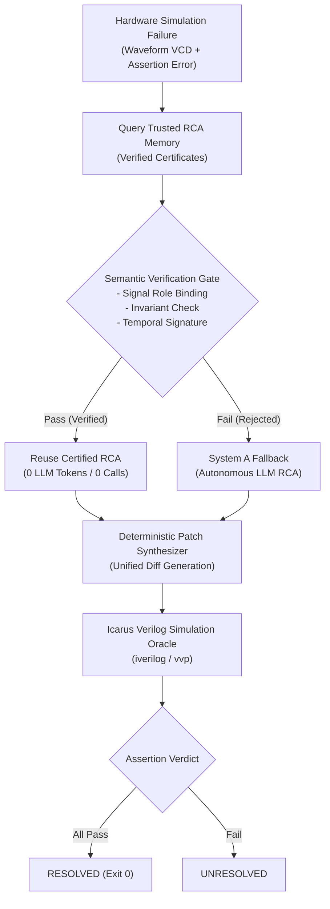

# RCA-Reuse: Verified Root Cause Analysis Reuse for Hardware Debugging

RCA-Reuse is a hardware debugging research project exploring whether verified previous root-cause analyses can be safely reused to resolve subsequent RTL simulation failures and reduce repeated LLM inference work.

---

## Why I Built It

Hardware debugging in RTL simulation takes a lot of time and compute. When debugging regression failures with LLMs, the model typically spends thousands of tokens analyzing multi-cycle waveforms and tracing signal causality from scratch—even when similar bug patterns have already been diagnosed, repaired, and verified before.

The intuitive answer is retrieval, but naive retrieval in hardware is dangerous: two completely different circuit bugs can produce identical failure symptoms (for example, a FIFO empty flag asserting prematurely). If you blindly transfer a previous diagnosis, you risk applying the wrong fix and breaking the design. I built this project to test whether adding a formal semantic verification gate could make diagnosis reuse safe enough to run autonomously on a small local model.

---

## What It Does

When an RTL simulation fails its testbench assertions:
1. **Queries trusted RCA memory**: Looks for candidate root-cause certificates from previously verified bugs.
2. **Performs semantic verification**: Checks that signal roles, contract invariants, and temporal error signatures match the new failure trace.
3. **Accepts or rejects**:
   - If verified, it reuses the previous root-cause explanation directly (0 LLM inference tokens).
   - If unverified or ambiguous, it safely rejects reuse and falls back to running autonomous LLM RCA from scratch.
4. **Synthesizes patches deterministically**: Converts the root-cause diagnosis into unified code diffs using deterministic rules rather than unconstrained code generation.
5. **Verifies in physical simulation**: Compiles the patched Verilog and runs the testbench in Icarus Verilog. A repair is only considered resolved if all hardware assertions pass.

---

## How It Works

Here is the end-to-end pipeline:



The system is tested as a controlled experiment comparing:
* **System A (Plain LLM RCA)**: Frozen model debugging from scratch with strictly zero memory access.
* **System B (Verified LLM-Reuse RCA)**: Same model with access to trusted memory, gated by semantic verification with fallback to System A on rejection.

Both systems use the exact same base model (`Qwen/Qwen2.5-Coder-1.5B-Instruct`), fine-tuned LoRA adapter (`soup_v7_qwen_lora`), greedy decoding ($T=0.0$), prompt templates, patch synthesizer, and Icarus Verilog verification oracle.

---

## Results

I evaluated this comparison across two main benchmarks: an expanded 100-case canonical benchmark across five digital design families, and a 30-case external benchmark across five unfamiliar functional domains.

| Milestone | Scope & Domain | System A (Plain LLM) | System B (Verified Reuse) | Absolute Delta | Token Reduction | Correct Reuses | False Reuses Observed | Negative Control Rejection |
| :--- | :--- | :---: | :---: | :---: | :---: | :---: | :---: | :---: |
| **V11 Benchmark** | 100 cases (FIFO, AXI, FSM, UART, Pipeline) | 40.0% (40/100) | **48.0% (48/100)** | **+8.0%** ($p = 0.007812$) | **42.64%** | 42 | **0** | **100% (30/30)** |
| **V12 External** | 30 cases (Memory, Bus, Arbiter, DMA, Crypto) | 16.67% (5/30) | **43.33% (13/30)** | **+26.67%** ($p = 0.007812$) | **36.67%** | 11 | **0** | **100% (10/10)** |

* **Zero false reuses were observed on the evaluated cases**: In all 53 accepted reuses (42 in V11, 11 in V12), the transferred root cause matched the true bug site.
* **Negative control safety**: All 40 adversarial negative controls (identical failure symptoms caused by unrelated signals) were safely rejected, falling back to autonomous investigation.
* **Why the verification gate matters (Ablation B)**: In an ablation where semantic verification was disabled and candidates were naively reused, nominal resolution changed, but the system committed 15 false reuses in V11 and 7 false reuses in V12 on negative controls. The gate prevented every one of those bad transfers.
* **Statistical significance**: McNemar exact tests yielded $p = 0.007812$ for both V11 and V12. 10,000-resample paired bootstrap 95% confidence intervals on the resolution delta were $[+3.0\%, +14.0\%]$ for V11 and $[+10.0\%, +43.33\%]$ for V12.

*Full details, contingency matrices, and per-domain breakdowns are in [RESULTS.md](RESULTS.md).*

---

## What I Learned

Building and iterating on this project taught me several practical engineering lessons:

1. **Naive reuse is worse than no reuse**: In early experiments before V8, simple similarity retrieval often matched on superficial symptoms. Forcing a fix from another bug corrupted the RTL and wasted simulation cycles. A verification gate that says "no" is essential.
2. **Small models can do useful work if you constrain the problem**: A 1.5B model struggles with open-ended hardware synthesis from raw RTL. But pairing it with structured causal certificates and deterministic patching let it achieve reliable bug resolution without expensive commercial APIs.
3. **Temporal horizons matter more than static signal names**: In hardware, signal names differ across codebases (`count` vs `fifo_cnt` vs `refresh_cnt`), but the temporal relationship between enable, clock edge, and register update is what defines the bug. Role normalization and temporal settlement windows were key to getting V12 to generalize.
4. **Negative controls are critical in benchmark design**: If a benchmark only includes cases where reuse is supposed to work, you can't measure whether your system knows when to stop. Including adversarial same-symptom negative controls was the only way to catch false reuse.
5. **Small sample sizes can be misleading**: In V10.1, a 25-case benchmark showed an 8% gain, but statistical testing showed $p = 0.500$—it was simply underpowered. Expanding to 100 cases in V11 was necessary to prove whether the gain was real.

---

## Limitations

Being upfront about what this project does and doesn't do:

* **Small base model**: All experiments run on a fine-tuned 1.5B parameter model (`Qwen2.5-Coder-1.5B-Instruct`). I have not tested how this behaves on 8B, 32B, or 70B models.
* **Benchmark nature**: The bugs evaluated are machine-validated defect instances modeled after real-world design patterns and structures from open-source IP (OpenCores, CirFix ASPLOS '22, open-source EDA IP). They are standardized for deterministic simulation in Icarus Verilog, not raw unedited commits scraped directly from commercial issue trackers. See [docs/BENCHMARK_PROVENANCE.md](docs/BENCHMARK_PROVENANCE.md).
* **Single-file localized repairs**: The current patch synthesizer handles single-site structural bug fixes and localized control logic. It does not handle large architectural redesigns or multi-module refactorings.
* **Unresolved bugs**: 52% of V11 cases and 56.7% of V12 cases were not resolved by either system. Deep multi-cycle protocol deadlocks and wide datapath interactions remain hard for a 1.5B model.
* **Observed zero false reuse is not a mathematical guarantee**: The gate verified 100% of tested cases correctly, but an unmodeled invariant or unusual clock interaction outside the tracked window could theoretically slip through.
* **Not production software**: This is an academic research prototype built to test an idea, not an industrial EDA tool.

---

## Repository Structure

```text
hardware-debug-failure-learning/
├── docs/                       # Architecture, benchmark provenance, and experiment reports
│   ├── ARCHITECTURE.md         # In-depth architectural breakdown & safety principles
│   ├── BENCHMARK_PROVENANCE.md # IP origins, bug construction, and licensing
│   ├── V11_GENERALIZATION_AND_STATISTICAL_EVALUATION.md
│   └── V12_EXTERNAL_GENERALIZATION_REPORT.md
├── experiments/                # Controlled evaluation runners
│   ├── run_v11_generalization.py      # V11 benchmark runner (N=100)
│   └── run_v12_external_validation.py  # V12 external benchmark runner (N=30)
├── results/                    # Machine-readable JSON reports & cost telemetry
│   ├── cost_analysis/          # Token, call, and latency measurements
│   └── reports/                # Evaluation outputs, manifests, and statistical tests
├── rtl/                        # Verilog source circuits and testbenches
│   ├── designs/                # Historical benchmark designs (FIFO, AXI, FSM, UART, Pipe)
│   └── v12/                    # External IP designs (SDRAM, I2C, SPI, Arbiter, DMA, SHA-3)
├── scripts/                    # Benchmark builders and audit tools
│   ├── build_v11_benchmark.py          # Builds canonical 100-case corpus
│   ├── build_v12_external_benchmark.py # Builds 30-case external corpus
│   ├── calculate_novelty_metrics.py    # Analyzes lexical divergence
│   └── check_integrity.py              # Validates 41 frozen evaluation artifacts
├── src/                        # Core library implementation
│   ├── agent/                  # LLM prompting and orchestration
│   ├── evaluation/             # Deterministic patch synthesizer and resolution engine
│   ├── reuse/                  # Semantic certificates, role normalizers, and safety gate
│   └── tools/                  # Icarus Verilog simulator and waveform parsers
├── tests/                      # Automated test suite (100 passed, 11 skipped)
├── RESULTS.md                  # Detailed empirical results across V8–V12
├── REPRODUCIBILITY.md          # Step-by-step setup and reproduction guide
└── CITATION.cff                # Citation metadata
```

---

## Running It

### Prerequisites
* Python 3.10–3.12
* [Icarus Verilog](https://bleyer.org/icarus/) (`iverilog` and `vvp`)

### Quickstart

```bash
# 1. Clone repository
git clone https://github.com/VaradaGovind/hardware-debug-failure-learning.git
cd hardware-debug-failure-learning

# 2. Set up virtual environment
python -m venv .venv
source .venv/bin/activate       # Linux / macOS
# .venv\Scripts\Activate.ps1    # Windows PowerShell

# 3. Install dependencies
pip install -e .
pip install pytest scipy

# 4. Run test suite
python -m pytest -q

# 5. Reproduce V11 canonical experiment (N=100)
python experiments/run_v11_generalization.py

# 6. Reproduce V12 external experiment (N=30)
python experiments/run_v12_external_validation.py
```

*For complete reproduction instructions, see [REPRODUCIBILITY.md](REPRODUCIBILITY.md).*

---

## Experiments

The project progressed across several milestones:

* **V7**: Trained a fine-tuned 1.5B model (`Qwen2.5-Coder-1.5B` + LoRA) with causal-discrimination training to improve raw LLM root-cause analysis on hardware bugs.
* **V8**: Implemented the unified semantic certificate architecture. Demonstrated that formal gating eliminated false reuses on a frozen 20-case evaluation while cutting inference tokens by ~22%.
* **V10.1**: Built the first end-to-end bug resolution pipeline connecting root-cause diagnoses to deterministic patch synthesis and Icarus Verilog assertion checks (48% System A vs. 56% System B on 25 cases).
* **V10.2**: Audited reproducibility across seeds and found that while results were deterministic, the 25-case stream was statistically underpowered ($p = 0.500$), demonstrating the need for a larger benchmark.
* **V11**: Expanded to a 100-case canonical benchmark across five digital design families. Proved statistically significant improvement (40% → 48%, $p = 0.007812$) with a 42.64% token reduction and 0 false reuses.
* **V12**: Tested external generalization on 30 structurally unfamiliar cases derived from open-source IP cores across five new domains (Memory, Bus, Arbiter, DMA, Crypto). Resolution improved from 16.7% to 43.3% ($p = 0.007812$) with a 36.67% token reduction and 0 false reuses observed.

---

## Citation

If you find this work or benchmark useful, please cite it using [CITATION.cff](CITATION.cff):

```bibtex
@software{aakula2026rcareuse,
  author = {Aakula, Varada Govind},
  title = {RCA-Reuse: Verified Root Cause Analysis Reuse for Hardware Debugging},
  url = {https://github.com/VaradaGovind/hardware-debug-failure-learning},
  version = {12.1.0},
  year = {2026}
}
```

---

## License

This project is licensed under the [MIT License](LICENSE). Third-party open-source RTL cores adapted for benchmarks are credited with their respective licenses in [docs/BENCHMARK_PROVENANCE.md](docs/BENCHMARK_PROVENANCE.md) and within source file headers in `rtl/v12/`.
