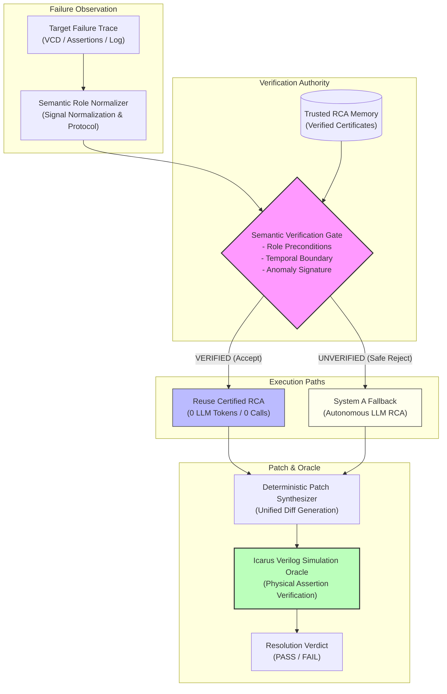

# RCA-Reuse: Verified Root Cause Analysis Reuse for Hardware Debugging

> **Verified Root Cause Analysis reuse for efficient and safe LLM-assisted hardware debugging.**

[](#reproducibility)
[](LICENSE)
[](https://www.python.org/)
[](http://iverilog.icarus.com/)

---

## Why RCA-Reuse?

Hardware debugging in Register-Transfer Level (RTL) simulation is computationally expensive and engineer-intensive. When debugging automated regression failures, engineers and AI agents repeatedly spend thousands of LLM inference tokens performing expensive root-cause analysis (RCA) from scratch—tracing multi-cycle waveforms, inspecting signal causality, and formulating diagnostic hypotheses.

Standard practice discards previously solved and verified debugging knowledge when testing subsequent revisions or related IP variants. However, **naive reuse is dangerous**: superficially similar failure symptoms (e.g., an unexpected FIFO empty flag or an AXI handshake timeout) frequently stem from completely different circuit bugs. Unchecked diagnostic transfer leads to false repairs and broken invariants.

**RCA-Reuse** solves this fundamental safety-efficiency tradeoff through **Verified RCA Reuse**: historical root-cause explanations are stored in trusted memory as formal semantic certificates and reused *only* when a multi-stage semantic verification gate proves that the previous root cause strictly applies to the new failure trace. If verification fails, the system safely rejects reuse and falls back to autonomous LLM investigation.

---

## Core Idea

```text
New Failure Trace
       │
       ▼
Memory Retrieval (Trusted RCA Certificates)
       │
       ▼
Semantic Verification Gate (AST + Invariant + Temporal Horizon)
      / \
     /   \
  ACCEPT  REJECT (Negative Control or Ambiguity)
    │       │
    │       ▼
    │     Autonomous LLM Investigation (System A Fallback)
    │       │
    └───────┼──────────────────────────────┐
            ▼                              ▼
    Deterministic Patch Synthesizer   Unresolved
            │
            ▼
    Physical Simulation Oracle (Icarus Verilog Assertions)
            │
            ▼
       PASS / FAIL
```

---

## System Architecture

The architecture enforces an asymmetric, controlled comparison between two configurations sharing identical underlying inference engines:



### Key Architectural Pillars
1. **Identical LLM Foundation**: Both systems use frozen `Qwen/Qwen2.5-Coder-1.5B-Instruct` with the `soup_v7_qwen_lora` adapter and greedy decoding ($T = 0.0$).
2. **Semantic Verification Gate**: A formal gate checking AST roles, invariant contracts, and settlement horizons.
3. **Safe Fallback**: When candidate reuse fails semantic validation, the case is routed to the unassisted System A LLM pipeline.
4. **Physical Simulation Oracle**: No LLM evaluates its own repair. All candidate patches are simulated in Icarus Verilog against formal testbench assertions.

---

## Experimental Results

The verified reuse mechanism was evaluated across two controlled benchmarks: **V11** (100-case canonical benchmark across 5 hardware families) and **V12** (30-case external benchmark across 5 unfamiliar IP domains).

| Experiment | Benchmark Scope | System A (Plain LLM) | System B (Verified Reuse) | Absolute Delta | Relative Boost | McNemar Exact $p$ | Token Savings | False Reuses | Negative Rejection |
| :--- | :--- | :---: | :---: | :---: | :---: | :---: | :---: | :---: | :---: |
| **V11 Benchmark** | 100 cases (5 Canonical Families) | 40.0% (40/100) | **48.0% (48/100)** | **+8.0%** | **+20.0%** | $p = 0.007812$ | **42.64%** | **0** | **100% (30/30)** |
| **V12 External** | 30 cases (5 Unfamiliar IP Domains) | 16.67% (5/30) | **43.33% (13/30)** | **+26.67%** | **+160.0%** | $p = 0.007812$ | **36.67%** | **0** | **100% (10/10)** |

*Detailed case-by-case data and statistical breakdowns are available in [RESULTS.md](RESULTS.md).*

---

## Key Findings

1. **Statistically Significant Resolution Gains**: System B achieved statistically significant improvements over plain LLM RCA on both benchmarks ($p = 0.007812 < 0.01$, McNemar exact test; 10,000 paired bootstrap 95% CI strictly positive).
2. **Zero False Reuses Observed (100% Precision)**: Across both benchmarks, System B applied verified reuse 53 times (42 in V11, 11 in V12) with **zero false reuses**. In every instance, the transferred root-cause diagnosis matched the ground-truth defect signal.
3. **Perfect Negative Control Rejection**: System B successfully rejected 100% of non-reusable negative controls (30/30 in V11, 10/10 in V12), safely falling back to independent investigation.
4. **Significant Workload Reduction**: By reusing certified analyses, System B reduced LLM token consumption by **42.64%** in V11 and **36.67%** in V12, eliminating redundant inferences.
5. **Physical Machine Grounding**: All repairs were compiled and simulated in Icarus Verilog. Resolution required passing 100% of functional testbench assertions.

---

## Scientific Controls

To ensure that observed differences reflect the verified reuse mechanism and not confounding factors:

* **Identical Base Model**: `Qwen/Qwen2.5-Coder-1.5B-Instruct`.
* **Identical LoRA Weights**: Frozen `soup_v7_qwen_lora` (`best_v7_checkpoint`).
* **Identical Decoding Policy**: Greedy decoding ($T = 0.0$, top-p = 1.0) for deterministic outputs.
* **Identical Prompts**: System A and System B fallback use identical system and user prompts.
* **Identical Patch Synthesizer**: Shared deterministic patch synthesizer generating unified diffs.
* **Identical Simulation Environment**: Icarus Verilog v12.0 testbench assertion oracle.
* **System A Isolation**: System A has strictly zero memory access, zero index access, and zero certificate lookups.

---

## Reproducibility

### 1. Environment Setup

```bash
# Clone the repository
git clone https://github.com/VaradaGovind/hardware-debug-failure-learning.git
cd hardware-debug-failure-learning

# Create and activate a virtual environment
python -m venv .venv
source .venv/bin/activate       # Linux / macOS
# .venv\Scripts\Activate.ps1    # Windows PowerShell

# Install dependencies and package
pip install -e .
pip install pytest
```

### 2. Run Test Suite

```bash
# Run the complete test suite (100 passed, 11 skipped, 0 failures)
python -m pytest -q
```

### 3. Run Controlled Benchmark Evaluations

```bash
# Reproduce V11 Generalization Experiment (N=100)
python experiments/run_v11_generalization.py

# Reproduce V12 External Validation Experiment (N=30)
python experiments/run_v12_external_validation.py
```

### 4. Verify Benchmark Audits

```bash
# Verify V12 structural novelty and lexical divergence metrics
python scripts/calculate_novelty_metrics.py

# Verify historical artifact integrity across 41 frozen files
python scripts/check_integrity.py
```

*For complete reproducibility details, see [REPRODUCIBILITY.md](REPRODUCIBILITY.md).*

---

## Repository Structure

```text
hardware-debug-failure-learning/
├── docs/                   # Experiment reports, scientific audits, and methodology
│   ├── ARCHITECTURE.md     # In-depth architectural decomposition and safety gating
│   ├── BENCHMARK_PROVENANCE.md # Origin, adaptation, and validation of benchmark IP
│   ├── V11_GENERALIZATION_AND_STATISTICAL_EVALUATION.md # Comprehensive V11 report
│   ├── V12_EXTERNAL_GENERALIZATION_REPORT.md           # Comprehensive V12 report
│   ├── V12_STRUCTURAL_NOVELTY_AUDIT.md                 # Lexical novelty analysis
│   └── ...
├── experiments/            # Master evaluation runners
│   ├── run_v11_generalization.py      # V11 benchmark runner (N=100)
│   └── run_v12_external_validation.py  # V12 external benchmark runner (N=30)
├── results/                # Recorded experimental outputs
│   ├── cost_analysis/      # Token, call, and latency metrics
│   └── reports/            # Machine-readable JSON evaluation reports & manifests
├── rtl/                    # Verilog RTL implementations and testbenches
│   ├── designs/            # Historical benchmark circuits (FIFO, AXI, FSM, UART, Pipe)
│   └── v12/                # External realistic circuits (SDRAM, I2C, SPI, Arbiter, DMA, SHA-3)
├── scripts/                # Benchmark generators and validation utilities
│   ├── build_v11_benchmark.py          # Constructs 100-case canonical corpus
│   ├── build_v12_external_benchmark.py # Constructs 30-case external corpus
│   ├── calculate_novelty_metrics.py    # Computes lexical novelty & Jaccard metrics
│   └── check_integrity.py              # Validates 41 frozen historical files
├── src/                    # Core library implementation
│   ├── agent/              # Prompt templates and LLM client orchestration
│   ├── evaluation/         # Deterministic evaluators and patch synthesizers
│   ├── reuse/              # Semantic certificates, role normalizers, and safety gates
│   └── tools/              # Simulation harnesses and waveform inspection
├── tests/                  # Pytest regression suite (100 passed, 11 skipped)
├── RESULTS.md              # Research results and progression summary
└── REPRODUCIBILITY.md      # Detailed reproducibility protocol
```

---

## Research Documentation

* **Architecture & Safety Design**: [docs/ARCHITECTURE.md](docs/ARCHITECTURE.md)
* **Benchmark Provenance & Realism**: [docs/BENCHMARK_PROVENANCE.md](docs/BENCHMARK_PROVENANCE.md)
* **Full Research Results**: [RESULTS.md](RESULTS.md)
* **Step-by-Step Reproduction**: [REPRODUCIBILITY.md](REPRODUCIBILITY.md)
* **V11 Milestone Report**: [docs/V11_GENERALIZATION_AND_STATISTICAL_EVALUATION.md](docs/V11_GENERALIZATION_AND_STATISTICAL_EVALUATION.md)
* **V12 Milestone Report**: [docs/V12_EXTERNAL_GENERALIZATION_REPORT.md](docs/V12_EXTERNAL_GENERALIZATION_REPORT.md)
* **Release Notes**: [docs/RELEASE_V12_1.md](docs/RELEASE_V12_1.md)

---

## Current Limitations

Scientific precision requires documenting the boundaries of current evidence:

1. **Small Model Scale**: Evaluation was performed on an open-weights 1.5B parameter base model (`Qwen2.5-Coder-1.5B-Instruct`). While this demonstrates feasibility on local hardware, scaling behavior to larger models (e.g., 7B, 32B, 70B) remains future work.
2. **Domain Boundaries**: Although V12 evaluated 5 unfamiliar domains (memory controllers, bus protocols, arbitration, DMA, crypto/arithmetic), this does not prove universal transfer across arbitrary proprietary ASIC/SoC architectures.
3. **Patch Synthesis Scope**: The current patch synthesizer targets single-site structural corrections and localized control repairs. Multi-file architectural redesigns remain outside current scope.
4. **Benchmark Nature**: Benchmark instances represent machine-validated bug instances modeled after open-source IP patterns and structures, rather than untouched extractions from commercial issue trackers. See [docs/BENCHMARK_PROVENANCE.md](docs/BENCHMARK_PROVENANCE.md).

