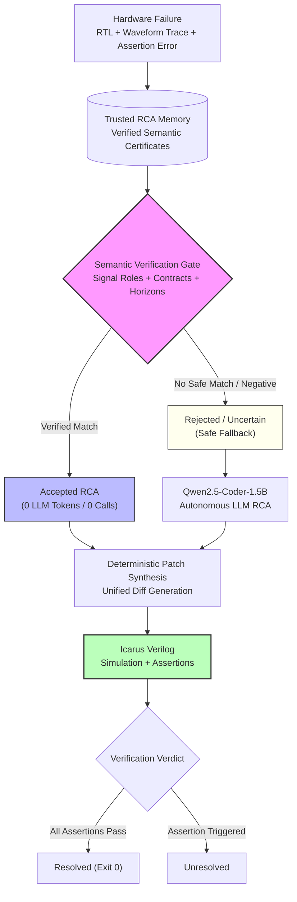

# 🧩 RCA-Reuse: Verified Hardware Root Cause Analysis Reuse


> 📘 **Comprehensive System Architecture & Technical Reports:**<br/>
> For in-depth architectural specifications, formal semantic contracts, and full benchmark evaluations, see the [**System Architecture Specification**](docs/ARCHITECTURE.md), [**Benchmark Provenance Report**](docs/BENCHMARK_PROVENANCE.md), and [**Master Results Summary**](RESULTS.md).

---

## 📌 Overview

**RCA-Reuse** is a hardware debugging research project that explores whether a small local language model can safely reuse previously verified root-cause analyses (RCA) instead of repeating the entire multi-turn debugging process from scratch for every RTL simulation failure.

The core idea is that the system does **not** blindly trust similar answers. A formal semantic verification layer checks whether a candidate prior RCA is actually applicable to the current failure waveform and contract invariants. If verification succeeds, the previous diagnosis is reused with zero LLM inference. If verification fails or evidence is incomplete, the system safely falls back to standard autonomous LLM investigation.

All experiments were deliberately designed around an open-weights **Qwen2.5-Coder-1.5B** model fine-tuned locally with LoRA, running on consumer hardware rather than relying on commercial cloud APIs.

---

## 📌 Why I Built It

I started this project from a simple question: **if two RTL failures have the same underlying cause, why should an LLM have to rediscover that cause from scratch every single time?**

In hardware regression testing, debugging failures with LLMs is computationally expensive. Models spend thousands of tokens parsing multi-cycle waveform traces (VCD) and tracing signal causality—even when the same bug pattern was already analyzed, diagnosed, and repaired in a previous revision or sibling IP core.

The intuitive answer is retrieval, but naive retrieval in hardware is dangerous: two completely different circuit bugs can produce identical failure symptoms (for example, an unexpected FIFO empty flag or an AXI handshake timeout). If you blindly transfer a prior diagnosis, you risk applying the wrong fix, breaking circuit invariants, and wasting simulation cycles. I built RCA-Reuse to test whether adding a formal semantic verification gate could make diagnosis reuse safe enough to run autonomously on a small local model.

---

## 📐 System Architecture

The following diagram illustrates the complete end-to-end execution flow:



The system is evaluated as a controlled comparison between two configurations:
* **System A (Plain LLM RCA)**: The autonomous LLM pipeline investigating each failure from scratch with strictly zero memory access.
* **System B (Verified LLM-Reuse RCA)**: The reuse-enabled pipeline with access to trusted memory, gated by semantic verification with automatic fallback to System A on rejection.

Both systems use the identical base model, LoRA adapter, greedy decoding policy ($T=0.0$), prompt templates, deterministic patch synthesizer, and Icarus Verilog simulation oracle.

---

## 📊 Results

### V12 — External / Structurally Unfamiliar Hardware Validation ($N=30$)
Evaluates 30 structurally unfamiliar cases across five functional domains (Memory Controllers, Bus Protocols, Arbitration, DMA Control, Crypto/Arithmetic) derived from authentic open-source IP cores (OpenCores, CirFix ASPLOS '22, open-source EDA IP):

| Metric | Plain LLM RCA (System A) | Verified RCA-Reuse (System B) | Impact / Delta |
| :--- | :---: | :---: | :---: |
| **Bug Resolution** | 16.7% (5 / 30) | **43.3% (13 / 30)** | **+26.7%** (+160.0% rel) |
| **95% Wilson Score CI** | [7.3%, 33.6%] | **[27.4%, 60.8%]** | Disjoint intervals |
| **LLM Inference Tokens** | 73,485 | **46,535** | **-36.67% reduction** |
| **LLM Invocations** | 60 | **38** | **-36.67% reduction** |
| **Correct Reuses** | — | **11** | 11 successful transfers |
| **False Reuses Observed** | — | **0** | **0 false reuses observed** |
| **Negative Control Rejection** | — | **10 / 10 (100.0%)** | 100% safe rejection |
| **McNemar Exact Test** | — | **$p = 0.007812$** | Statistically significant ($p < 0.01$) |
| **Bootstrap 95% CI (Delta)** | — | **[+10.0%, +43.33%]** | 10,000 paired resamples |

### V11 — Canonical Benchmark Generalization ($N=100$)
Evaluates 100 canonical debugging cases across five digital design families (FIFO buffers, AXI-Stream interfaces, FSM sequencers, UART controllers, Pipelined datapaths):

| Metric | Plain LLM RCA (System A) | Verified RCA-Reuse (System B) | Impact / Delta |
| :--- | :---: | :---: | :---: |
| **Bug Resolution** | 40.0% (40 / 100) | **48.0% (48 / 100)** | **+8.0%** (+20.0% rel) |
| **95% Wilson Score CI** | [30.9%, 49.8%] | **[38.5%, 57.7%]** | Positive distribution shift |
| **LLM Inference Tokens** | 217,300 | **124,640** | **-42.64% reduction** |
| **LLM Invocations** | 200 | **116** | **-42.00% reduction** |
| **Correct Reuses** | — | **42** | 42 successful transfers |
| **False Reuses Observed** | — | **0** | **0 false reuses observed** |
| **Negative Control Rejection** | — | **30 / 30 (100.0%)** | 100% safe rejection |
| **McNemar Exact Test** | — | **$p = 0.007812$** | Statistically significant ($p < 0.01$) |
| **Bootstrap 95% CI (Delta)** | — | **[+3.0%, +14.0%]** | 10,000 paired resamples |

### Project Progression Summary

| Milestone | Scope & Cases | Main Experimental Focus |
| :---: | :---: | :--- |
| **V7** | Synthetic RTL | Fine-tuned 1.5B model with causal-discrimination training for baseline RCA. |
| **V8** | 20 cases | Unified semantic certificate architecture and formal verification gating. |
| **V10.1** | 25 cases | First end-to-end controlled bug-resolution comparison with deterministic patching. |
| **V10.2** | 25 cases | Multi-seed stability audit; identified that $N=25$ was statistically underpowered ($p=0.500$). |
| **V11** | 100 cases | Expanded canonical benchmark across 5 hardware families ($p = 0.007812$, -42.6% tokens). |
| **V12** | 30 cases | External validation on unfamiliar IP cores across 5 domains ($p = 0.007812$, +26.7% resolution). |

*Full case-level logs, transition matrices, and family breakdowns are documented in [RESULTS.md](RESULTS.md).*

---

## 🔍 Why Verification Matters

Naive retrieval (e.g. standard embedding similarity or unverified RAG) can look superficially attractive because it forces more matches. However, our ablation experiments (**Ablation B: Unverified Naive Reuse**) show the danger:

* In **V11**, disabling verification caused **15 false reuses** on negative controls, collapsing decision precision to 82.4%.
* In **V12**, disabling verification caused **7 false reuses** on negative controls, corrupting design functionality.

Verified RCA-Reuse **intentionally rejects uncertain matches** rather than forcing a repair. Across all 53 accepted reuses in V11 and V12, **0 false reuses were observed on the evaluated cases**, and 100% of negative controls (40/40) were safely rejected. See [docs/V12_EXTERNAL_GENERALIZATION_REPORT.md](docs/V12_EXTERNAL_GENERALIZATION_REPORT.md) for detailed ablation data.

---

## ✨ Key Features

* **✔ Verified RCA Memory:** Previous root-cause analyses are stored as structured semantic certificates (AST role bindings, invariant contracts, temporal horizons) rather than unstructured text.
* **✔ Semantic Verification Gate:** Candidate reuse matches must prove consistency against observed signal waveforms and RTL contract obligations before being trusted.
* **✔ Small Local LLM:** Built around `Qwen2.5-Coder-1.5B-Instruct` with a fine-tuned LoRA adapter (`soup_v7_qwen_lora`), keeping local inference fast and reproducible without third-party APIs.
* **✔ Safe Fallback:** Designed to reject uncertain reuse. When a candidate fails verification or evidence is incomplete, the system falls back to autonomous LLM investigation.
* **✔ Deterministic Hardware Verification:** Patches are synthesized via rule-based unified diffs and verified through physical Icarus Verilog compilation and assertion checking.
* **✔ Token Efficiency:** Reusing certified analyses reduced inference token consumption by 42.64% in V11 and 36.67% in V12.
* **✔ Negative-Control Testing:** Explicitly evaluated against adversarial same-symptom negative controls and truncated traces to ensure the system does not hallucinate matches.

---

## 🤖 Model

* **Base Model:** `Qwen/Qwen2.5-Coder-1.5B-Instruct` (open weights)
* **Adapter:** `soup_v7_qwen_lora` (`best_v7_checkpoint`)
* **Decoding Policy:** Greedy decoding ($T = 0.0$, top-p = 1.0) for deterministic outputs
* **Hardware Context:** Evaluated locally on consumer hardware (AMD Ryzen 7 CPU, local Icarus Verilog)

The project deliberately focuses on a 1.5B parameter model so that experiments can be run locally and the true benefit of verified reuse can be evaluated without masking the mechanics behind massive cloud-hosted models.

---

## 🚀 Verification & Testing

Every claim in the project is backed by automated tests, deterministic patching, and physical RTL simulation:

* **Pytest Test Suite:** 15 test suites validating schema integrity, certificate storage, deterministic patching, data isolation, negative control safety, and artifact immutability.
* **Test Status:** **100 passed, 11 skipped, 0 failed** in ~20 seconds.
  *(The 11 skipped tests check optional local fine-tuning dataset caches that are intentionally excluded from Git; all 100 benchmark, schema, isolation, and regression tests pass unconditionally.)*
* **Historical Immutability:** 41 frozen evaluation artifacts are cryptographically verified via SHA-256 using `scripts/check_integrity.py`.
* **Hardware Simulation:** Patches are compiled with `iverilog` and simulated with `vvp`. A case is resolved if and only if all testbench assertions pass across all clock cycles.

---

## ⚠️ Current Limitations

Being upfront about what this project does and does not do:

* **Model Capacity:** All experiments use a 1.5B base model. While this shows what small local models can do with structured memory, scaling behavior to 7B, 32B, or 70B models remains unmeasured.
* **Evaluated Domains:** While V12 evaluates five unfamiliar IP domains (memory controllers, bus protocols, arbitration, DMA, crypto/arithmetic), this does not prove universal transfer across arbitrary proprietary SoC architectures.
* **Localized Patch Scope:** The deterministic patch synthesizer handles localized control repairs and single-site defects. Multi-module architectural refactorings are outside current scope.
* **Unresolved Bugs:** 52.0% of V11 cases and 56.67% of V12 cases were unresolved by both systems, reflecting the difficulty of deep multi-cycle protocol deadlocks for small models.
* **Empirical Observations:** The observed 0 false reuses is an empirical measurement on the evaluated benchmark cases, not a formal mathematical guarantee.
* **Academic Prototype:** This is a student research prototype designed to explore verified reuse, not an industrial EDA tool.

---

## 📂 Directory Structure

```text
hardware-debug-failure-learning/
├── rtl/                        # Verilog RTL implementations and testbenches
│   ├── designs/                # Canonical benchmark circuits (FIFO, AXI, FSM, UART, Pipe)
│   ├── bugs/                   # Seed defect implementations
│   ├── testbenches/            # Self-checking testbenches with assertion monitors
│   └── v12/                    # External realistic circuits across 5 domains (30 cases)
├── src/                        # Core library implementation
│   ├── agent/                  # LLM prompting and orchestration
│   ├── evaluation/             # Deterministic patch synthesis & resolution engines
│   ├── reuse/                  # Semantic certificates, role normalizers, and safety gates
│   └── tools/                  # Icarus Verilog simulator harness and VCD parsers
├── experiments/                # Controlled evaluation runners
│   ├── run_v11_generalization.py      # V11 benchmark runner (N=100)
│   └── run_v12_external_validation.py  # V12 external benchmark runner (N=30)
├── scripts/                    # Benchmark builders and audit tools
│   ├── build_v11_benchmark.py          # Constructs 100-case canonical corpus
│   ├── build_v12_external_benchmark.py # Constructs 30-case external corpus
│   ├── check_integrity.py              # Validates 41 frozen evaluation artifacts
│   └── calculate_novelty_metrics.py    # Analyzes lexical novelty and divergence
├── tests/                      # Automated test suite (100 passed, 11 skipped)
├── results/                    # Machine-readable experiment records
│   ├── reports/                # Evaluation outputs, manifests, and statistical tests
│   └── cost_analysis/          # Token, call, and latency measurement summaries
├── docs/                       # Architecture, provenance, and detailed reports
│   ├── ARCHITECTURE.md         # In-depth architectural decomposition & safety gating
│   ├── BENCHMARK_PROVENANCE.md # IP origins, adaptation methodology, and licensing
│   └── ...
├── datasets/                   # Dataset documentation (heavy JSONs excluded from Git)
├── training/                   # Local LoRA training configs and schemas
├── README.md                   # Project overview and visual guide
├── RESULTS.md                  # Comprehensive empirical results across V8–V12
├── REPRODUCIBILITY.md          # Step-by-step setup and reproduction guide
├── CITATION.cff                # Citation metadata (CFF 1.2.0)
└── LICENSE                     # MIT License
```

---

## 🛠️ Running the Project

### Prerequisites
* Python 3.10, 3.11, or 3.12
* [Icarus Verilog](https://bleyer.org/icarus/) (`iverilog` and `vvp`)

### Setup
```bash
# 1. Clone repository
git clone https://github.com/VaradaGovind/hardware-debug-failure-learning.git
cd hardware-debug-failure-learning

# 2. Create and activate a virtual environment
python -m venv .venv
source .venv/bin/activate       # Linux / macOS
# .venv\Scripts\Activate.ps1    # Windows PowerShell

# 3. Install dependencies
pip install -e .
pip install pytest scipy
```

### Run Tests & Evaluations
```bash
# Run the automated test suite (100 passed, 11 skipped)
python -m pytest -q

# Run V11 Generalization Experiment (N=100)
python experiments/run_v11_generalization.py

# Run V12 External Validation Experiment (N=30)
python experiments/run_v12_external_validation.py

# Run cryptographic integrity check on 41 frozen artifacts
python scripts/check_integrity.py

# Run lexical novelty scanner on V12 benchmark
python scripts/calculate_novelty_metrics.py
```

*For complete reproduction instructions, see [REPRODUCIBILITY.md](REPRODUCIBILITY.md).*

---

## ⚖️ License

This project is released under the [MIT License](LICENSE). You are free to use, modify, and redistribute the code subject to the terms of the license.

Third-party open-source RTL cores adapted for benchmarks are credited with their respective licenses (MIT, BSD, Apache-2.0, LGPL) in [docs/BENCHMARK_PROVENANCE.md](docs/BENCHMARK_PROVENANCE.md) and within source file headers in `rtl/v12/`.
