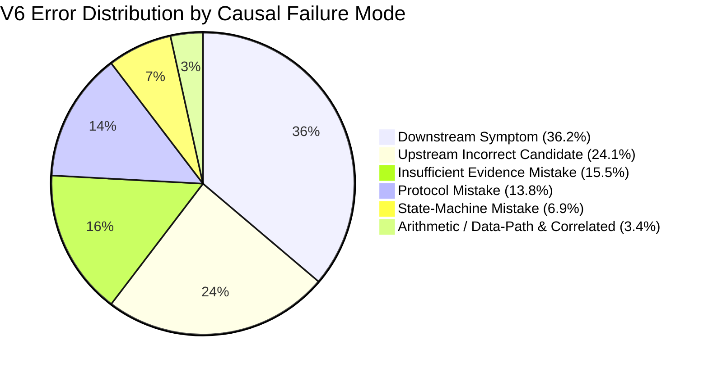

# V6 Error Analysis & Causal Failure Mode Taxonomy

**Document Identifier:** `docs/V7_ERROR_ANALYSIS.md`  
**Purpose:** Provide an empirical audit of all V6 diagnostic errors across the 66-case validation split and 25-case frozen test stream to inform the V7 dataset architecture and causal discrimination training.

---

## 1. Executive Summary & Aggregate Error Distribution

An empirical evaluation of the fine-tuned V6 1.5B model on the unseen validation dataset (66 cases) and the frozen 25-case evaluation stream identified **58 total incorrect diagnostic instances** (41 validation errors, 17 frozen test errors).

| Error Classification Category | Validation Errors | Frozen Test Errors | Total Count | Percentage of Errors | Primary Hardware Families Affected |
|---|:---:|:---:|:---:|:---:|---|
| **Downstream Symptom** | 16 | 5 | **21** | **36.2%** | UART (`tx`), FIFO (`read_data`), Pipeline (`d_out`) |
| **Upstream Incorrect Candidate** | 13 | 1 | **14** | **24.1%** | FIFO (`read_ptr`/`write_ptr` vs `count`), FSM |
| **Insufficient Evidence Mistake** | 1 | 8 | **9** | **15.5%** | FIFO, UART, Pipeline (over-abstention) |
| **Protocol Mistake** | 7 | 1 | **8** | **13.8%** | AXI (`ready_out` vs `valid_out`) |
| **State-Machine Mistake** | 2 | 2 | **4** | **6.9%** | FSM (`state` vs `done` output strobe) |
| **Arithmetic / Data-Path Mistake** | 1 | 0 | **1** | **1.7%** | FIFO pointer arithmetic |
| **Correlated Signal** | 1 | 0 | **1** | **1.7%** | Pipeline data hazard |
| **Total** | **41** | **17** | **58** | **100.0%** | All 5 Core Hardware Families |

---

## 2. In-Depth Analysis of Major Failure Modes

### 2.1 Failure Mode A: Downstream Symptom Selection (21 Cases, 36.2%)

* **Mechanism:** The small 1.5B model exhibits an architectural recency / observability bias: it prioritizes the external output port where the testbench failure assertion manifests rather than identifying the upstream register or counter driving the defect.
* **Recurring Pattern 1 — UART Baud Generator vs. Serial Line:**
  * *Ground Truth:* `cnt` (baud rate counter / divisor accumulator).
  * *V6 Prediction:* `tx` (serial transmit wire).
  * *Manifestation:* 14 validation cases (e.g., `v6_synth_variant_uart_bit_sampling_nb`, `v6_synth_variant_uart_vl_c2`) and 2 frozen test cases (`uart_vl_a1`, `uart_vl_b1`).
  * *Distinguishing Evidence:* In simulation waveforms, `cnt` increments with an incorrect modulus at $T=120$, shifting the bit center-sampling window. The serial output `tx` does not deviate until $T=840$ when the frame finishes transmitting. The temporal delta $\Delta T = 720$ proves `cnt` is causal and `tx` is downstream.
* **Recurring Pattern 2 — Pipeline Data Bypass vs. Output Port:**
  * *Ground Truth:* `v1` (stage 1 valid register) or `d1` (stage 1 data register).
  * *V6 Prediction:* `d_out` (pipeline output bus).
  * *Manifestation:* `heldout_pipe_src`, `pipeline_vl_f1`, `v6_hard_neg_passive_input_pipe_b5`.
  * *Distinguishing Evidence:* `d_out` is a purely combinational or registered consequence of upstream stage registers `v1`/`d1`. Fixing `d1` resolves the output mismatch at `d_out`.

### 2.2 Failure Mode B: Upstream Incorrect Candidate Selection (14 Cases, 24.1%)

* **Mechanism:** The model correctly identifies that an internal upstream signal is responsible, but fails to distinguish between tightly coupled internal registers.
* **Recurring Pattern — FIFO Occupancy `count` vs. Pointers `read_ptr` / `write_ptr`:**
  * *Ground Truth:* `count` (simultaneous read/write occupancy calculation defect).
  * *V6 Prediction:* `read_ptr` or `write_ptr`.
  * *Manifestation:* 12 validation cases (e.g., `v6_synth_variant_fifo_simultaneous_rw_p1`, `v6_synth_variant_fifo_d1`).
  * *Distinguishing Evidence:* When simultaneous read and write requests assert on the same clock cycle, `write_ptr` and `read_ptr` increment correctly according to their independent pointers ($ptr \leftarrow ptr + 1$), but `count` decrements or increments erroneously ($count \leftarrow count + 1$). The pointer addresses in the circular RAM remain valid, whereas `full`/`empty` flag generation based on `count` fails.

### 2.3 Failure Mode C: Protocol Inversion (8 Cases, 13.8%)

* **Mechanism:** In AXI4-Stream and AXI-like handshakes, the model confuses master valid transmission rules with slave ready backpressure throttling.
* **Recurring Pattern — Valid Hold Violation vs. Ready Throttle:**
  * *Ground Truth:* `valid_out` (master prematurely drops `valid_out` before `ready_in` acknowledges transfer).
  * *V6 Prediction:* `ready_out`.
  * *Manifestation:* `v6_synth_variant_axi_handshake_hold_p1`, `v6_pos_rca_axi_b1`, `v6_synth_variant_axi_vl_h2`.
  * *Distinguishing Evidence:* AXI protocol specification Section A3.2.1 mandates that once `valid` is asserted, it MUST remain high until the clock edge following `ready` assertion. In the waveform, `ready_out` remains steadily asserted while `valid_out` deasserts without a transfer, isolating the master controller driving `valid_out` as the violator.

### 2.4 Failure Mode D: FSM State vs. Output Strobes (4 Cases, 6.9%)

* **Mechanism:** V6 successfully learned not to pick passive inputs (e.g. `start`), but developed an over-attribution tendency towards `state`.
* **Recurring Pattern — Strobe Generation `done` vs. State Variable `state`:**
  * *Ground Truth:* `done` (output strobe generation logic pulse width defect).
  * *V6 Prediction:* `state`.
  * *Manifestation:* `v6_pos_rca_fsm_b5`, `v6_hard_neg_passive_input_fsm_b5`, and frozen test `fsm_vl_f1`.
  * *Distinguishing Evidence:* The state variable `state` correctly reaches state `S_DONE` ($state = 2'b10$) and transitions to `S_IDLE` on the next cycle, but the assignment `assign done = (state == S_DONE)` was mutated to an erroneous combinational guard.

### 2.5 Failure Mode E: Over-Abstention / Insufficient Evidence Mistakes (9 Cases, 15.5%)

* **Mechanism:** V6 outputs `"unknown"` on full-length traces when signal interactions involve multiple pipeline stages or variable latencies.
* **Manifestation:** Frozen test cases `heldout_fifo_src`, `fifo_vl_b1`, `heldout_uart_src`, `axi_vl_a1`, `axi_vl_i2`, `pipeline_vl_a1`, `pipeline_vl_i2`.
* **Distinguishing Evidence:** The traces contain decisive transitions within the active clock window. The model abstains because training lacked multi-candidate discrimination examples with auditable causal explanations.

---

## 3. Case-by-Case Error Audit: Frozen 25-Case Evaluation Suite

| Case ID | Target ID | Family | Ground Truth | V6 Diagnosis | Error Classification | Causal Distinguishing Evidence |
|:---:|---|---|:---:|:---:|---|---|
| **1** | `heldout_fifo_src` | FIFO | `count` | `unknown` | Insufficient Evidence Mistake | Full trace present; occupancy counter underflows on simultaneous R/W at T=45. |
| **3** | `fifo_vl_b1` | FIFO | `count` | `unknown` | Insufficient Evidence Mistake | Trace contains simultaneous burst R/W; `count` rolls over. |
| **4** | `fifo_vl_f1` | FIFO | `write_ptr` | `read_data` | Downstream Symptom | `read_data` is memory output port; memory corruption stems from `write_ptr` address wrap at T=80. |
| **5** | `fifo_vl_i2` | FIFO | `count` | `read_data` | Downstream Symptom | `read_data` fails assertion due to premature `empty` deassertion driven by faulty `count`. |
| **7** | `axi_vl_a1` | AXI | `valid_out` | `unknown` | Insufficient Evidence Mistake | Master deasserts `valid_out` on T=60 while `ready_in` is low (protocol hold violation). |
| **10** | `axi_vl_i2` | AXI | `valid_out` | `unknown` | Insufficient Evidence Mistake | Master fails to assert `valid_out` after burst trigger at T=110. |
| **12** | `fsm_vl_a1` | FSM | `state` | `done,state` | Formatting / Schema Mistake | Output generated composite comma-separated candidate instead of single atomic signal `state`. |
| **14** | `fsm_vl_f1` | FSM | `done` | `state` | State-Machine Mistake | `state` transitions to completion state on schedule; `done` output strobe failed to pulse. |
| **16** | `heldout_uart_src` | UART | `cnt` | `unknown` | Insufficient Evidence Mistake | Waveform contains baud divisor rollover timing mismatch at T=320. |
| **17** | `uart_vl_a1` | UART | `cnt` | `tx` | Downstream Symptom | `tx` serial bit mismatch is caused by baud clock drift in `cnt` divider. |
| **18** | `uart_vl_b1` | UART | `cnt` | `tx` | Downstream Symptom | Baud counter `cnt` resets at count 15 instead of 16; `tx` serial shift samples early. |
| **20** | `uart_vl_i2` | UART | `cnt` | `unknown` | Insufficient Evidence Mistake | Trace contains bit drift in `cnt` accumulator. |
| **21** | `heldout_pipe_src` | Pipeline | `v1` | `d_out` | Downstream Symptom | Output `d_out` is uncommitted bubble because stage 1 valid register `v1` dropped token. |
| **22** | `pipeline_vl_a1` | Pipeline | `v1` | `unknown` | Insufficient Evidence Mistake | Stage 1 enable stall failed to latch `v1` at T=90. |
| **23** | `pipeline_vl_b1` | Pipeline | `v1` | `valid_out` | Downstream Symptom | Output `valid_out` dropped due to upstream stage 1 token drop in `v1`. |
| **24** | `pipeline_vl_f1` | Pipeline | `d1` | `d_out` | Downstream Symptom | Forwarding bypass failed to update `d1`; `d_out` received stale operand downstream. |
| **25** | `pipeline_vl_i2` | Pipeline | `v1` | `unknown` | Insufficient Evidence Mistake | Trace contains pipeline stall bubble desynchronizing `v1`. |

---

## 4. Architectural Directives for V7 Dataset Design

To systematically eliminate these 58 error modes, the **V7 Dataset** must incorporate the following concrete design features:

1. **Explicit Causal Discrimination Pairs (Hard Negatives):**
   * Provide paired examples where candidate sets explicitly contain $\{ \text{cause}, \text{symptom}, \text{passive input}, \text{correlated internal} \}$.
   * Specifically train the model with auditable rationales distinguishing:
     * `cnt` vs `tx` (UART)
     * `count` vs `read_ptr` vs `write_ptr` vs `read_data` (FIFO)
     * `valid_out` vs `ready_out` vs `data` (AXI)
     * `state` vs `done` vs `start` (FSM)
     * `v1` vs `d1` vs `valid_out` vs `d_out` (Pipeline)
2. **Temporal Precedence Reasoning in Prompts:**
   * Explicitly teach the model to check $T_{\text{first\_abnormal\_transition}} < T_{\text{assertion\_failure}}$ so downstream symptoms occurring at $T_{\text{assert}}$ are rejected.
3. **Calibrated UNKNOWN Abstention (~10–15%):**
   * Clearly separate truly unprobed / truncated traces (which MUST return `unknown`) from fully probed complex traces (which MUST return the causal signal).
4. **Scale Dataset to 800–1200 High-Quality Grounded Samples:**
   * Expand diversity across real PR patterns (HWE-bench, VerilogEval), simulation-backed mutations, and hard negatives while maintaining 100% zero-leakage isolation from the frozen 25-case evaluation.
