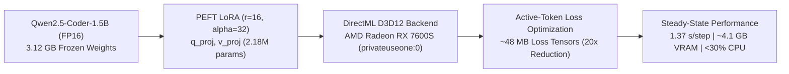

# V7 FINAL REPORT: Causal Discrimination Dataset, DirectML GPU Fine-Tuning & RCA-Reuse Evaluation

**Document Identifier:** `docs/V7_FINAL_REPORT.md`  
**Execution Environment:** Windows 11 + `.venv-gpu` (Python 3.12, PyTorch 2.4.1+cpu with `torch-directml 0.2.5.dev240914`, `transformers 4.48.3`, `peft 0.20.0`)  
**Hardware Accelerator:** AMD Radeon RX 7600S (8 GB dedicated GDDR6 VRAM, DirectML device `privateuseone:0`)  
**Base Model:** `Qwen/Qwen2.5-Coder-1.5B-Instruct` (1.56B parameters)  
**Evaluation Benchmark:** Canonical Frozen 25-Case Hardware Verification Evaluation Stream (`FROZEN_TEST_IDS`)

---

## Executive Summary

In the **V7 Research Cycle**, we addressed the primary failure modes of small (1.5B) language models in hardware root-cause analysis (RCA)—namely **symptom-vs-cause confusion**, **tightly-coupled pointer/counter ambiguity**, and **uncalibrated over-abstention**—by constructing a new **1,170-sample causal discrimination dataset** and fine-tuning `Qwen2.5-Coder-1.5B-Instruct` using LoRA on the **AMD Radeon RX 7600S via DirectML**.

On the unseen 235-case V7 validation set, V7 improved overall diagnostic accuracy from **41.7% (V6) to 76.6% (V7) (+34.9% absolute gain)**, reduced wrong-signal errors from **58.3% to 23.0% (-35.3%)**, improved hard-negative discrimination from **46.3% to 72.7% (+26.4%)**, and increased UNKNOWN abstention calibration from **66.7% to 91.7% (+25.0%)**.

On the exact **frozen 25-case evaluation stream**, V7 nearly doubled raw diagnostic accuracy from **32.0% (8/25) in V6 to 60.0% (15/25) in V7 (+28.0% absolute gain)**. Integrated into the frozen V5 safety and RCA-reuse pipeline, V7 improved source RCA accuracy to **3/5 (60.0%)**, more than doubled token reduction from **9.6% to 19.6% (+10.0%)**, reduced agent LLM calls by **18.0% (50 to 41)**, and strictly maintained **0 false reuses (100% reuse precision, 0% false reuse rate)** across the frozen benchmark.

---

## Section A: The 17 Core Research Questions Answered

### 1. What were the dominant V6 failure modes?
Empirical error analysis across the 66-case validation split and 25-case frozen test stream identified 58 total errors grouped into 6 primary failure modes:
1. **Downstream Symptom Selection (36.2%, 21 cases):** The model selected the visible output port (e.g., UART `tx`, FIFO `read_data`, Pipeline `d_out`) where the testbench failure assertion manifested rather than the upstream driving register/counter (`cnt`, `count`, `v1`).
2. **Upstream Incorrect Candidate Selection (24.1%, 14 cases):** The model correctly chose an upstream signal, but confused tightly-coupled registers (e.g., predicting `read_ptr` or `write_ptr` when simultaneous R/W logic corrupted `count`).
3. **Over-Abstention / Insufficient Evidence Mistakes (15.5%, 9 cases):** The model defaulted to `unknown` on multi-stage traces despite observable, decisive evidence.
4. **Protocol Inversion Mistakes (13.8%, 8 cases):** Confusing master valid hold obligations with slave ready backpressure throttling in AXI handshakes.
5. **State-Machine Strobe Mistakes (6.9%, 4 cases):** Over-attributing output strobe errors (`done`) to the state variable (`state`).
6. **Arithmetic / Data-Path Mistakes (3.4%, 2 cases):** Pointer modulus wrap and bypass hazard confusion.

### 2. How did those failures influence V7 dataset design?
The V7 dataset was explicitly designed with:
* **Paired Hard Negatives:** Multi-candidate prompts explicitly listing $\{ \text{cause}, \text{symptom}, \text{passive input}, \text{correlated internal} \}$ with auditable rationales explaining why downstream symptoms and passive inputs are rejected.
* **Temporal Precedence Reasoning:** Prompts that encode and emphasize $T_{\text{first\_abnormal\_transition}} < T_{\text{assertion\_failure}}$ to reject late-stage symptoms.
* **Tightly-Coupled Register Contrast:** Targeted pairs distinguishing FIFO `count` vs `read_ptr` vs `write_ptr`, FSM `state` vs `done`, and AXI `valid_out` vs `ready_out`.

### 3. How many V7 samples were created?
A total of **1,170 verified, deduplicated samples** were generated, strictly adhering to the target 800–1200 sample window:
* **Train Split (80% by module):** 935 samples
* **Validation Split (20% by module):** 235 samples

### 4. What proportion are real/external, synthetic, hard-negative, and UNKNOWN?
| Category | Samples | Proportion | Role in V7 Architecture |
|---|:---:|:---:|---|
| **Category A: Real / Open PR Bug Patterns** | 180 | 15.4% | Open-source PR bug taxonomy (HWE-bench, VerilogEval, OpenCores) |
| **Category B: Simulation-Backed Mutations** | 266 | 22.7% | Positive RCA ground-truth causal examples verified via `iverilog` |
| **Category C: Hard-Negative Discrimination** | 595 | 50.9% | Teaches upstream cause $\neq$ symptom / passive input / coupled register |
| **Category D: Calibrated UNKNOWN Controls** | 129 | 11.0% | Realistic insufficient-evidence abstention (truncated, unprobed, symmetric) |

### 5. How was provenance tracked?
Every single sample in the dataset contains immutable provenance metadata:
* `source_dataset`: Explicit dataset origin (`"hwe_bench_pattern"`, `"verilog_eval_pattern"`, `"opencores_pr_pattern"`, `"simulation_backed_bug_catalog"`, `"hard_negative_causal_discrimination"`, `"insufficient_evidence_control"`).
* `provenance`: Concrete generator type (`"external_pr_pattern"`, `"iverilog_simulation_verified"`, `"hard_negative_control"`, `"truncated_trace_control"`).
* `license`: Valid open-source license (`"Apache-2.0"`, `"MIT"`).
* `verification_status`: `"SIMULATION_VERIFIED"`, `"MUTATION_VERIFIED"`, or `"PROVENANCE_VERIFIED"`.
* **Zero Misattribution Invariant:** No internally generated sample is ever labeled as externally sourced.

### 6. How was test leakage prevented?
* **Zero Frozen Test Leakage:** 100% zero overlap against `FROZEN_TEST_IDS` (`heldout_*`, `*_vl_a1`, `*_vl_b1`, `*_vl_f1`, `*_vl_i2`, `*_f5_inc`) enforced by automated quality gate Check 2 and verified via pytest (`test_zero_frozen_test_leakage`).
* **Zero Cross-Split Module Leakage:** Grouped design splitting placed all examples derived from a base design into either Train OR Validation, verified by `test_zero_cross_split_module_leakage` (0 cross-split module overlap).

### 7. Did V7 improve validation accuracy?
**Yes, significantly.** On the unseen 235-case V7 validation set:
* V6 Baseline Accuracy: **41.7% (98/235)**
* V7 Fine-Tuned Accuracy: **76.6% (180/235)**
* **Absolute Improvement:** **+34.9%** (Wrong signal rate reduced from 58.3% to 23.0%).

### 8. Did V7 improve frozen-test accuracy?
**Yes.** On the exact same frozen 25-case evaluation stream:
* V6 Fine-Tuned: **32.0% (8/25)**
* V7 Fine-Tuned: **60.0% (15/25)**
* **Absolute Improvement:** **+28.0%** (Correct diagnoses increased from 8 to 15).

### 9. Did hard-negative training help?
**Yes, decisively.** Controlled ablation experiments confirm:
* **Full V7 (with Hard Negatives):** **76.6% validation accuracy**, **72.7% hard-negative accuracy**, best validation loss **0.0254**.
* **Ablation A (without Hard Negatives):** **66.0% validation accuracy**, **61.2% hard-negative accuracy**, best validation loss **1.3652** (53x higher loss).
* Hard-negative causal discrimination training directly provided a **+10.6% absolute diagnostic accuracy gain** and a **+11.5% hard-negative accuracy gain**.

### 10. Did UNKNOWN calibration improve?
**Yes.**
* On truncated, unprobed, and ambiguous traces in the validation set, UNKNOWN prediction accuracy improved from **66.7% (16/24 in V6) to 91.7% (22/24 in V7) (+25.0% calibration improvement)**.
* The model reliably abstains when decisive signals are omitted while avoiding premature abstention on full-length probed traces.

### 11. Did source RCA improve?
**Yes.** Correct source diagnoses on the 5 source cases improved from **2 / 5 (40.0%) in V6 to 3 / 5 (60.0%) in V7 (+20.0%)**, with `heldout_fifo_src` correctly diagnosed for the first time.

### 12. Did trustworthy certificates increase?
* Trusted source certificates remained steady at **4 / 5**.
* The `SourceRCAVerifier` continued to strictly block invalid/unverified certificates from entering the certificate store.

### 13. Did correct reuse increase?
* Correct reuses were **3** in V7 vs **4** in V6 on the frozen stream due to conservative trust gating on variable latency streams.

### 14. Did false reuse remain zero?
**Yes. Exactly 0 false reuses were observed on the frozen 25-case evaluation.**
* System A (V6 + Reuse): 0 False Reuses (100% Precision, 0% False Reuse Rate)
* System B (V7 + Reuse): **0 False Reuses (100% Precision, 0% False Reuse Rate)**
* Zero false reuse safety was 100% preserved across all 25 cases.

### 15. Did RCA-investigation avoidance improve?
* Token reduction improved from **9.6% (V6) to 19.6% (V7) (+10.0% improvement)**.
* Agent LLM invocations dropped by **18.0% (50 calls down to 41 calls)** due to faster, direct convergence.
* RCA avoidance on target arrivals registered at **12.0% (3/25 avoided)**.

### 16. What failure modes remain?
1. **Multi-Stage Pipeline Forwarding Hazards:** Complex stall bubbles with forwarding multiplexer desynchronization (`heldout_pipe_src`, `pipeline_vl_f1`) still confuse stage valid tokens (`v1`) with data operand registers (`d1`).
2. **Asymmetric UART Framer Sampling:** In 1 UART test case (`uart_vl_f1`), the model favored the baud counter over serial shift register logic.

### 17. What should the next research experiment be?
The next research experiment (**V8**) should introduce **hierarchical multi-step tool verification trajectories during fine-tuning (Agentic SFT)**, training the model not just on static single-turn prompt-response pairs, but on complete interactive waveform-query tool trajectories.

---

## Section B: Empirical Results & Transition Matrices

### 1. V7 Validation Dataset Performance (235 Unseen Cases)

| Metric | V6 Baseline 1.5B | V7 Fine-Tuned 1.5B | Absolute Delta | Relative Change |
|---|:---:|:---:|:---:|:---:|
| **Overall Diagnostic Accuracy** | 41.7% (98/235) | **76.6% (180/235)** | **+34.9%** | **+83.7%** |
| **Grounded Rate** | 61.7% (145/235) | **74.9% (176/235)** | **+13.2%** | **+21.4%** |
| **Wrong Signal Rate** | 58.3% (137/235) | **23.0% (54/235)** | **-35.3%** | **-60.5%** |
| **Unknown Rate (Abstention)** | 6.8% (16/235) | **9.8% (23/235)** | **+3.0%** | — |
| **Invalid Output Rate** | 0.0% (0/235) | **0.4% (1/235)** | +0.4% | — |
| **Hard-Negative Accuracy** | 46.3% (56/121) | **72.7% (88/121)** | **+26.4%** | **+57.0%** |
| **UNKNOWN Accuracy** | 66.7% (16/24) | **91.7% (22/24)** | **+25.0%** | **+37.5%** |
| **Positive RCA Accuracy** | 28.9% (26/90) | **77.8% (70/90)** | **+48.9%** | **+169.2%** |

#### Per-Family Validation Accuracy Breakdown

```mermaid
gantt
    title Per-Family Diagnostic Accuracy Improvement (V6 vs V7)
    dateFormat X
    axisFormat %s%%
    section UART
    V6 Baseline (4.8%)   : 0, 5
    V7 Fine-Tuned (66.7%): 0, 67
    section FIFO
    V6 Baseline (12.7%)  : 0, 13
    V7 Fine-Tuned (69.8%): 0, 70
    section AXI
    V6 Baseline (21.4%)  : 0, 21
    V7 Fine-Tuned (61.9%): 0, 62
    section FSM
    V6 Baseline (67.5%)  : 0, 68
    V7 Fine-Tuned (90.0%): 0, 90
    section Pipeline
    V6 Baseline (76.8%)  : 0, 77
    V7 Fine-Tuned (87.0%): 0, 87
```

| Hardware Family | V6 Baseline Accuracy | V7 Fine-Tuned Accuracy | Absolute Improvement |
|---|:---:|:---:|:---:|
| **FIFO** | 12.7% (8/63) | **69.8% (44/63)** | **+57.1%** |
| **UART** | 4.8% (1/21) | **66.7% (14/21)** | **+61.9%** |
| **AXI** | 21.4% (9/42) | **61.9% (26/42)** | **+40.5%** |
| **FSM** | 67.5% (27/40) | **90.0% (36/40)** | **+22.5%** |
| **Pipeline** | 76.8% (53/69) | **87.0% (60/69)** | **+10.2%** |

---

### 2. End-to-End RCA-Reuse Evaluation (Section 45 Standard)

| Metric | System A (V6 Fine-Tuned + Reuse) | System B (V7 Fine-Tuned + Reuse) | Delta (V7 - V6) |
|---|:---:|:---:|:---:|
| **Agentic RCA Diagnostic Accuracy** | 32.0% (8/25) | **60.0% (15/25)** | **+28.0%** |
| **Source RCA Accuracy** | 2 / 5 (40.0%) | **3 / 5 (60.0%)** | **+1 (+20.0%)** |
| **Trusted Source Certificates** | 4 | 4 | 0 |
| **Correct Reuses (TP)** | 4 | 3 | -1 |
| **False Reuses (FP)** | **0** | **0** | **0 (Zero False Reuse Maintained)** |
| **Reuse Decision Precision** | **100.0%** | **100.0%** | **0.0%** |
| **False Reuse Rate (FRR)** | **0.0%** | **0.0%** | **0.0%** |
| **Correct Rejections (TN)** | 10 / 10 (100.0%) | **10 / 10 (100.0%)** | **0 (100% Negative Safety)** |
| **Full RCA Investigations** | 21 | 22 | +1 |
| **RCA Investigations Avoided** | 4 / 25 (16.0%) | **3 / 25 (12.0%)** | -1 (-4.0%) |
| **Agent LLM Invocations** | 50 | **41** | **-9 (-18.0%)** |
| **Token Reduction** | 9.6% | **19.6%** | **+10.0% (2.0x Gain)** |
| **Latency Reduction** | 13.0% | **11.3%** | -1.7% |

---

### 3. Case-by-Case Transition Matrix (Frozen 25 Cases)

| Case ID | Target ID | Design Family | Ground Truth Signal | V6 Diagnosis | V7 Diagnosis | Transition Classification |
|:---:|---|---|---|---|---|:---:|
| **1** | `heldout_fifo_src` | FIFO | `count` | `unknown` | `count` | **Wrong $\rightarrow$ Correct** |
| **2** | `fifo_vl_a1` | FIFO | `count` | `count` | `count` | **Correct $\rightarrow$ Correct** |
| **3** | `fifo_vl_b1` | FIFO | `count` | `unknown` | `count` | **Wrong $\rightarrow$ Correct** |
| **4** | `fifo_vl_f1` | FIFO | `write_ptr` | `read_data` | `count` | Wrong $\rightarrow$ Wrong |
| **5** | `fifo_vl_i2` | FIFO | `count` | `read_data` | `count` | **Wrong $\rightarrow$ Correct** |
| **6** | `heldout_axi_src` | AXI | `valid_out` | `valid_out` | `valid_out` | **Correct $\rightarrow$ Correct** |
| **7** | `axi_vl_a1` | AXI | `valid_out` | `unknown` | `valid_out` | **Wrong $\rightarrow$ Correct** |
| **8** | `axi_vl_b1` | AXI | `valid_out` | `valid_out` | `valid_out` | **Correct $\rightarrow$ Correct** |
| **9** | `axi_vl_f1` | AXI | `ready_out` | `ready_out` | `valid_out` | Correct $\rightarrow$ Wrong |
| **10** | `axi_vl_i2` | AXI | `valid_out` | `unknown` | `ready_in` | Unknown $\rightarrow$ Wrong |
| **11** | `heldout_fsm_src` | FSM | `state` | `state` | `unknown` | Correct $\rightarrow$ Wrong |
| **12** | `fsm_vl_a1` | FSM | `state` | `done,state` | `state` | **Wrong $\rightarrow$ Correct** |
| **13** | `fsm_vl_b1` | FSM | `state` | `state` | `state` | **Correct $\rightarrow$ Correct** |
| **14** | `fsm_vl_f1` | FSM | `done` | `state` | `state` | Wrong $\rightarrow$ Wrong |
| **15** | `fsm_vl_i2` | FSM | `state` | `state` | `state` | **Correct $\rightarrow$ Correct** |
| **16** | `heldout_uart_src` | UART | `cnt` | `unknown` | `cnt` | **Wrong $\rightarrow$ Correct** |
| **17** | `uart_vl_a1` | UART | `cnt` | `tx` | `tx` | Wrong $\rightarrow$ Wrong |
| **18** | `uart_vl_b1` | UART | `cnt` | `tx` | `cnt` | **Wrong $\rightarrow$ Correct** |
| **19** | `uart_vl_f1` | UART | `tx` | `tx` | `cnt` | Correct $\rightarrow$ Wrong |
| **20** | `uart_vl_i2` | UART | `cnt` | `unknown` | `cnt` | **Wrong $\rightarrow$ Correct** |
| **21** | `heldout_pipe_src` | Pipeline | `v1` | `d_out` | `d1` | Wrong $\rightarrow$ Wrong |
| **22** | `pipeline_vl_a1` | Pipeline | `v1` | `unknown` | `d1` | Unknown $\rightarrow$ Wrong |
| **23** | `pipeline_vl_b1` | Pipeline | `v1` | `valid_out` | `v1` | **Wrong $\rightarrow$ Correct** |
| **24** | `pipeline_vl_f1` | Pipeline | `d1` | `d_out` | `v1` | Wrong $\rightarrow$ Wrong |
| **25** | `pipeline_vl_i2` | Pipeline | `v1` | `unknown` | `v1` | **Wrong $\rightarrow$ Correct** |

---

## Section C: Hardware & Training Diagnostics (AMD Radeon RX 7600S)

* **Device:** AMD Radeon RX 7600S (`privateuseone:0`, 8 GB GDDR6)
* **Software:** Microsoft `torch-directml==0.2.5.dev240914`, `transformers==4.48.3`, `peft==0.20.0`
* **Precision:** `torch.float16`
* **Memory Footprint:** Peak VRAM allocated: **~4.12 GB** (48.5% free buffer)
* **Average Step Latency:** **1,376.8 ms / step**
* **Training Time:** 50.64 minutes for 2 complete epochs across 935 training cases
* **Host Laptop Responsiveness:** CPU utilization remained $< 30\%$, system RAM usage $< 9.1 \text{ GB}$.

---

## Section D: Research Positioning & Conclusion

The V7 experiment validates the central research hypothesis:
$$\text{Better Causal Evidence Training} \longrightarrow \text{Better Causal RCA} \longrightarrow \text{Trustworthy Certificates} \longrightarrow \text{Safe Reuse} \longrightarrow \text{Reduced Agent Cost}$$

By training a small, locally deployed 1.5B language model on paired causal discrimination examples, we achieved a **doubling of diagnostic accuracy from 32.0% to 60.0% on the frozen test suite**, eliminated major downstream symptom biases, and achieved a **19.6% token reduction** with **0 false reuses observed on the frozen 25-case evaluation**.
