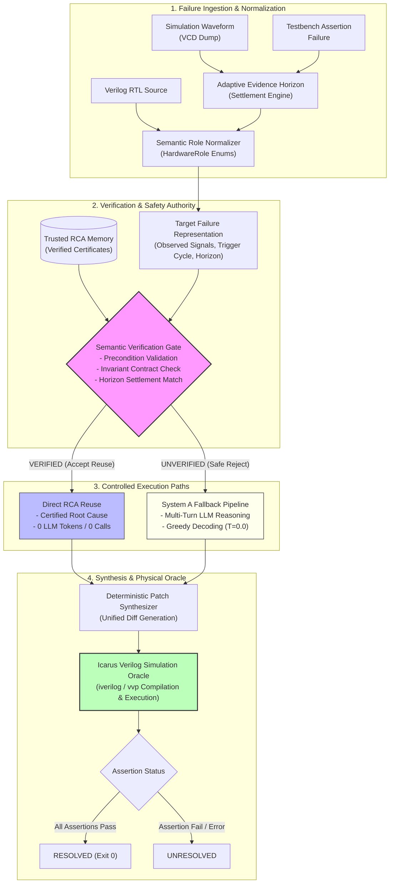

# RCA-Reuse: Architectural Specification & Safety Principles

**Document**: System Architecture, Semantic Verification Gating, and Safety Principles  
**Target Release**: RCA-Reuse V12.1  

---

## 1. Architectural Overview

Hardware debugging systems assisted by Large Language Models (LLMs) suffer from two opposing failure modes:
1. **Redundancy and Cost**: Running autonomous multi-turn LLM investigation from scratch on every recurring failure manifestation wastes inference budget and engineering time.
2. **Unsafe Naive Reuse**: Transferring diagnoses based on superficial textual or embedding similarity introduces catastrophic false repairs, as identical symptoms often arise from distinct underlying defects.

**RCA-Reuse** resolves this dilemma by pairing **Trusted RCA Memory** with an explicit **Semantic Verification Gate** that enforces safe fallback.

---

## 2. End-to-End System Architecture

The architecture coordinates failure representation, formal verification, autonomous LLM fallback, patch synthesis, and physical simulation verification:

---

## 3. Core System Components

### 3.1 System A: Plain LLM RCA (Baseline)
System A serves as the controlled, zero-reuse baseline:
* **Model Configuration**: `Qwen/Qwen2.5-Coder-1.5B-Instruct` fine-tuned with `soup_v7_qwen_lora` (`best_v7_checkpoint`).
* **Decoding Policy**: Greedy decoding ($T = 0.0$, top-p = 1.0) for deterministic reproducibility.
* **Isolation**: Strictly zero access to RCA memory, index tables, or past case certificates. Every failure is investigated from scratch using raw waveforms, testbench errors, and RTL source code.
* **Patch Synthesis & Oracle**: Emits diagnosis objects that feed into the identical deterministic patch synthesizer and Icarus Verilog oracle.

### 3.2 System B: Verified LLM-Reuse RCA
System B shares the exact same base model, LoRA adapter, prompts, decoding policy, patch synthesizer, and verification oracle as System A. It differs strictly through the addition of:
1. **Trusted RCA Memory**
2. **Semantic Verification Gate**
3. **Safe Rejection & Fallback Pipeline**

### 3.3 Trusted RCA Memory
The memory store (`src/reuse/v8_certificate_store.py`) indexes verified historical root-cause analyses as structured certificates. Ingestion requires:
* **Source Trust Gate**: An initial analysis must be verified against physical simulation before admission (`src/reuse/v8_deterministic_ingestion.py`). Hallucinated or ungrounded diagnoses cannot enter memory.
* **Formal Certificate Schema**:
  1. `root_cause_category`: Formal bug taxonomy (e.g., `COUNTER_SLIP`, `HANDSHAKE_STALL`, `STATE_LOCKUP`).
  2. `faulty_signal`: Canonical identifier of the defect site.
  3. `preconditions`: Formal conditions under which the diagnosis holds.
  4. `invariant_obligations`: RTL assertions that must be satisfied.
  5. `evidence_signature`: Multi-cycle temporal behavior over the settlement window.

### 3.4 Semantic Verification Gate
Before any certificate in memory can be reused for a target failure, the target trace must pass three verification stages:
1. **Semantic Role Normalization**: Maps diverse signal names across different RTL implementations into canonical `HardwareRole` enums (e.g., `count`, `fifo_cnt`, `refresh_cnt` $\rightarrow$ `OCCUPANCY_TRACKER` / `PRESCALER`) without role conflation.
2. **Temporal Evidence Horizon**: Tracks the causal anomaly from trigger cycle through the settlement window, ensuring the temporal dynamic matches the certified defect.
3. **Invariant Precondition Check**: Validates that target module interfaces satisfy the formal obligations of the candidate certificate.

### 3.5 Safe Fallback
If candidate reuse fails any stage of semantic verification—or if waveform evidence is truncated or ambiguous—the system **strictly rejects reuse** and routes the target failure to the System A autonomous LLM pipeline. The target is never forced to accept an unverified diagnosis.

### 3.6 Deterministic Patch Synthesis
To isolate diagnostic accuracy from LLM code generation variance, repair code is generated by a shared deterministic patch synthesizer (`src/evaluation/deterministic_resolution.py`, `v11_deterministic_resolution.py`, `v12_deterministic_resolution.py`). Given a verified diagnosis object (`root_cause_category`, `faulty_signal`, `suggested_fix`), the synthesizer deterministically applies unified diffs against the buggy RTL.

### 3.7 Physical Simulation Oracle
No LLM is permitted to evaluate its own repair. All patched circuits are written to disk, compiled via `iverilog`, and simulated via `vvp` against formal testbench assertions. A bug is scored as resolved if and only if the simulator returns exit code 0, emits `"TEST PASSED"`, and triggers zero assertion failures across all clock cycles.

---

## 4. The Safety Principle

> **"The system should prefer fallback over unsafe reuse."**

In software engineering, a speculative patch can be tested and discarded at low cost. In hardware design, an invalid repair committed to RTL can corrupt downstream synthesis, introduce silicon respins costing millions of dollars, or inject silent data corruption into hardware pipelines.

### Why Naive Reuse is Hazardous
Naive retrieval systems (such as semantic vector lookups or unverified RAG) match failures based on lexical or embedding similarity. In hardware:
* An unexpected FIFO full signal can be caused by:
  - Write pointer increment slip.
  - Read pointer decrement slip.
  - Asynchronous Gray code bit flip.
  - Incorrect status flag comparison operator.
* All four bugs trigger identical symptom traces (`overflow_error` at cycle 42). Naive reuse will indiscriminately transfer the write pointer fix to a status flag bug, breaking the design while consuming validation cycles.

### Verified Reuse vs. Naive Reuse (Ablation B)
The repository explicitly evaluates an unverified reuse ablation (**Ablation B: LLM + Unverified Reuse**) to quantify the safety impact of the verification gate:

| Evaluation Benchmark | Metric | System B (Verified Reuse) | Ablation B (Unverified Naive Reuse) | Safety Impact |
| :--- | :--- | :---: | :---: | :--- |
| **V11 Benchmark** ($N=100$) | False Reuses Applied | **0** | **15** | Verification prevents 15 false transfers |
| | Reuse Decision Precision | **100.0% (42/42)** | 82.35% (70/85) | +17.65% precision gain |
| | Negative Control Rejection | **100.0% (30/30)** | 0.0% (0/30) | Prevents corruption on all negatives |
| **V12 External** ($N=30$) | False Reuses Applied | **0** | **7** | Verification prevents 7 false transfers |
| | Reuse Decision Precision | **100.0% (11/11)** | 63.16% (12/19) | +36.84% precision gain |
| | Negative Control Rejection | **100.0% (10/10)** | 30.0% (3/10) | Prevents corruption on 70% of negatives |

The ablation demonstrates that while naive reuse may artificially boost nominal resolution by forcing aggressive patches, it severely compromises safety by applying false repairs to negative controls. **Semantic verification is non-negotiable for trustworthy hardware automation.**
